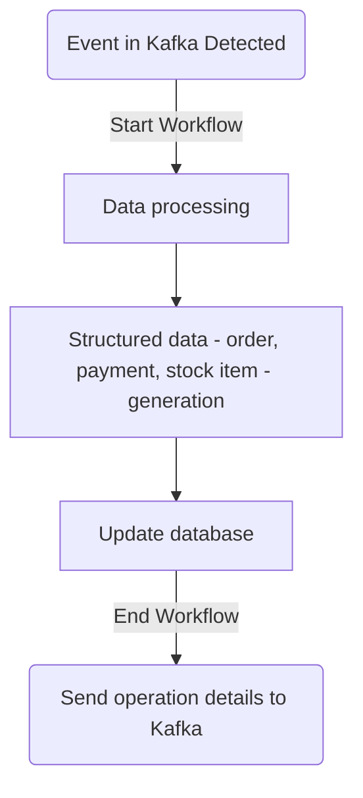
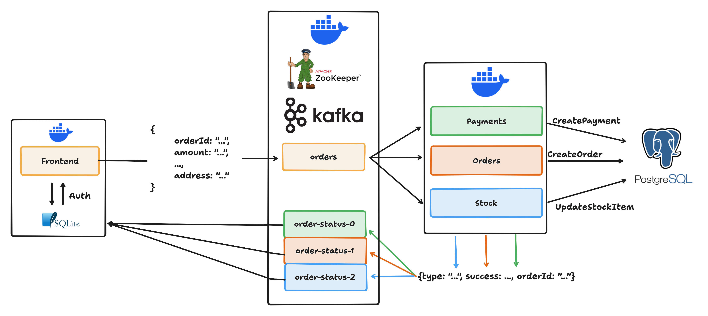

# workflows-microservices

This project showcases how you can use [LlamaIndex Workflows](https://github.com/run-llama/workflows-py) in the context of an event-driven microservices architecture (this example implements an ecommerce-like experience).

## Quickstart

If you want to try out the application without too many intermediate steps, you can by following these three steps:

- Clone this repository:

```bash
git clone https://github.com/AstraBert/workflows-microservices
ccd workflows-microservices
```

- Run with Docker compose (make sure the Docker Daemon is active):

```bash
docker compose up -d
```

- Visit the application at `localhost:8000`. You can sign up, log in, choose a product and place an order.

## Application Structure

The application is composed by seven distinct microservices:

- Frontend and authentication ([`main`](./main/))
- Payments processing service ([`payments`](./payments/))
- Orders processing service ([`orders`](./orders/))
- Stock management service ([`stock`](./stock/))
- Postgres (stock, orders and payments database)
- Kafka (event-driven communication between microservices)
- Zookeeper (Kafka management)

### Frontend and Authentication

The `main` service is a Go webserver built upon [Fiber](https://gofiber.io) (backend) , [Templ](https://templ.guide) (HTML templates rendering), [Bootstrap](https://getbootstrap.com) (CSS) and [HTMX](https://htmx.org) (interaction with backend).

You can find the following folders:

- `handlers`: contains all the HTTP requests handler functions, that handle HTML rendering and authentication
- `db`: an [slqc](https://slqc.dev)-generated package that implements the interactions with the SQLite database that keeps track of the users and their authenticated sessions (`users.db`). The sqlc configuration is defined in `sqlc.yaml` and the database schema and SQL queries are, respectively, in `schema.sql` and `query.sql`.
- `templates`: Templ-managed  HTML templates
- `commons` : utility functions used across packages

### Payments, Orders and Stock processing

These three microservices are uv-based python projects that follow the same structure (within the `src/{service-name}` folder):

- `db`: an [slqc](https://slqc.dev)-generated package that implements interactions with the Postgres database. The schema for each of the database tables is defined in `schema.sql` and the queries in `query.sql`. 
- `workflow`: the LlamaIndex Workflow through which the interaction with the database and with Kafka are managed.

Each of these python microservices has its own executable (`process-{service-name}`), which is used as an entrypoint in the Docker container.

The executables follow this general schema:



### Kafka orchestration

Kafka orchestrates the communication within microservices through two topics:

- `orders`: the frontend writes to this topic when an order is placed
- `order-status` (three partitions): the payment, order and stock processing services each write to a partition of the `order-status` topic to update the frontend on the operation status.

## Visualization

Here is a visualization of the data flow among microservices:



## License

This project is distributed under an [MIT License](./LICENSE)

## Contributing

Contributions are always welcome! See the [contributing guide](./CONTRIBUTING.md) for more details.